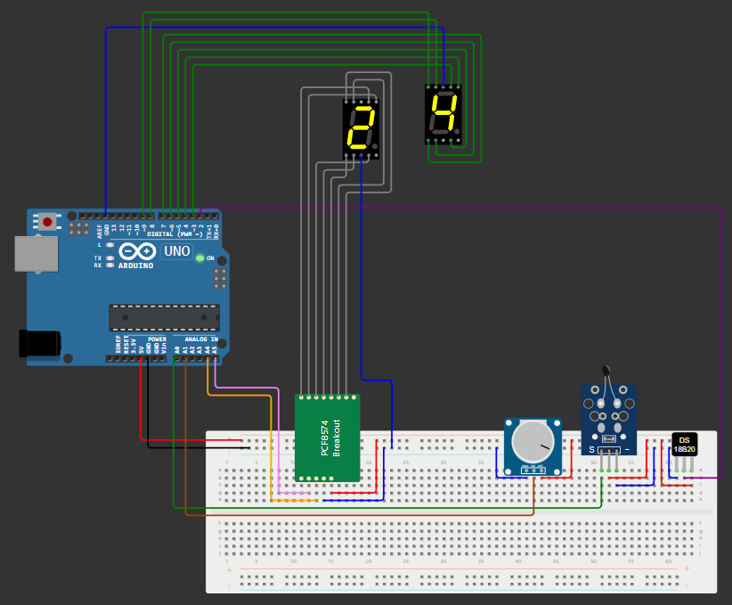

# Sistema de medición de temperatura con Arduino

Este proyecto consiste en un sistema de medición de temperatura que utiliza un Arduino y varios componentes electrónicos. A continuación, se detalla el funcionamiento del sistema y los componentes utilizados:

## Descripción del Proyecto:

El sistema de medición de temperatura tiene las siguientes características:

1. **Medición de Temperatura:** Utiliza dos sensores de temperatura diferentes para medir la temperatura ambiente. Uno de los sensores es el DS18B20 y el otro es un sensor NTC. El sistema calcula el promedio de las lecturas de ambos sensores para obtener una medición más precisa de la temperatura.
2. **Visualización de la Temperatura:** Muestra la temperatura medida en dos pantallas de 7 segmentos. Una pantalla muestra las unidades de temperatura y la otra muestra las decenas.
3. **Intervalo de Medición Ajustable:** El sistema permite ajustar el intervalo de tiempo entre cada medición de temperatura. Este intervalo es configurable mediante un potenciómetro, lo que permite al usuario cambiar la frecuencia de las mediciones según sus necesidades.

## Componentes Utilizados:

- Placa de desarrollo Arduino (Arduino UNO)
- Sensor de Temperatura DS18B20
- Sensor de Temperatura NTC
- 2 displays de 7 Segmentos
- Potenciómetro
- Expansor de E/S I2C (HW-171)
- Resistencias y componentes electrónicos varios

## Conexiones:

## Instalación:

1. Instala las bibliotecas de `Wire.h`, `OneWire` y `DallasTemperature` en tu entorno de desarrollo Arduino si aún no lo has hecho. Puedes hacerlo desde el Administrador de bibliotecas en el IDE de Arduino.
2. Carga el código fuente `arduino_project.ino` y ábrelo en tu entorno de desarrollo Arduino.
3. Observa los display de siete segmentos mostrar la temperatura.

## Licencia

Este proyecto está bajo la Licencia MIT. Consulta el archivo [licensia](./LICENSE) para obtener más información.
