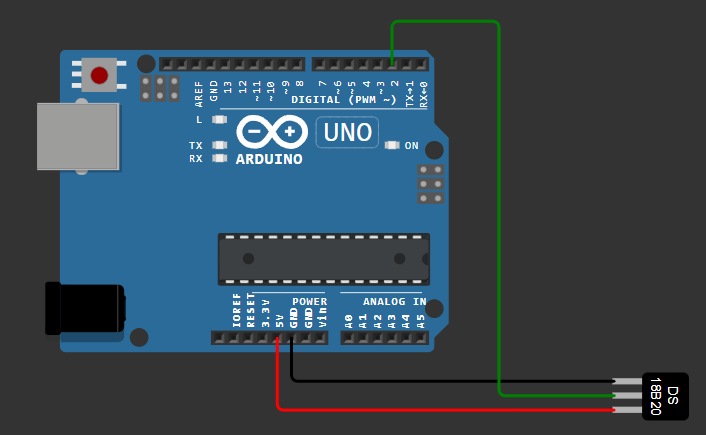

# Medidor de Temperatura con Sensor DS18B20

Programa para Arduino que utiliza un sensor DS18B20 para medir la temperatura ambiente y mostrarla en grados Celsius a través del monitor serial.

## Requisitos

- Placa de desarrollo Arduino (Arduino UNO)
- Sensor de temperatura DS18B20
- Resistor de 4.7k ohmios (para la conexión del sensor DS18B20)
- Cableado para conectar el sensor DS18B20 a la placa Arduino

## Conexiones

El sensor DS18B20 debe conectarse al pin digital especificado en el código. Asegúrate de revisar la hoja de datos del sensor DS18B20 para conocer las especificaciones de los pines del módulo.

## Instalación

1. Conecta el sensor DS18B20 a la placa Arduino según las especificaciones de conexión.
2. Carga el archivo `ds18b20.ino` en tu placa Arduino utilizando el IDE de Arduino.
3. Abre el monitor serial para ver las lecturas de temperatura en grados Celsius.

## Funcionamiento

El programa utiliza la biblioteca **OneWire** y **DallasTemperature** para comunicarse con el sensor DS18B20 y realizar la medición de temperatura. Luego, muestra la temperatura medida por el monitor serial en grados Celsius.

## Configuración

Asegúrate de definir correctamente el pin digital al que está conectado el sensor DS18B20 en la línea `#define ONE_WIRE_BUS`. Esta macro debe coincidir con el pin al que está conectado físicamente el sensor en tu configuración.
