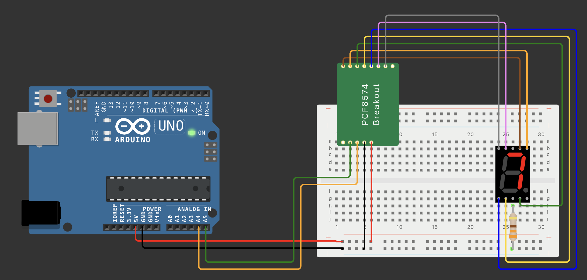

# Display de siete segmentos con Expansor PCF8574 (módulo HW-171)

Se muestra cómo utilizar un display de siete segmentos con un expansor de E/S HW-171 y Arduino para contar del 0 al 9.

## Requisitos

- Placa de desarrollo Arduino (Arduino UNO)
- Módulo expansor de E/S HW-171
- Display de siete segmentos de cátodo común
- Cables de conexión

## Conexiones

Conecta el display de siete segmentos al módulo expansor HW-171 siguiendo el esquema de pines adecuado:

## Instalación

1. Instala la biblioteca Wire.h en tu entorno de desarrollo Arduino si aún no lo has hecho. Puedes hacerlo desde el Administrador de bibliotecas en el IDE de Arduino.
2. Carga el código fuente `expander_pcf8574.ino` y ábrelo en tu entorno de desarrollo Arduino.
3. Observa el display de siete segmentos contar del 0 al 9.

## Funcionamiento

El código utiliza un vector `numbers` que contiene los patrones de segmentos para cada dígito del 0 al 9. La función `displayNumber()` envía el patrón correspondiente al número dado al módulo HW-171 a través del bus I2C. El bucle `loop()` muestra cada número del 0 al 9 de forma secuencial con un retardo de 500 milisegundos entre cada número.
