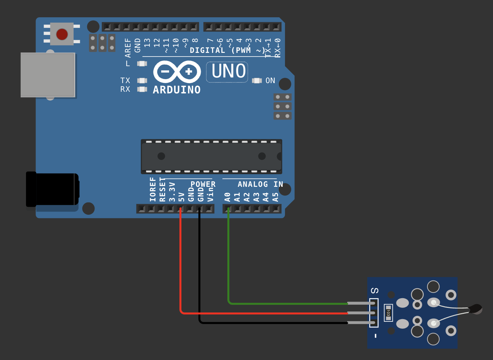

# Medidor de Temperatura con Sensor NTC

Programa para Arduino que utiliza un sensor NTC (Coeficiente de Temperatura Negativo) para medir la temperatura ambiente y mostrarla en grados Celsius a través del monitor serial.

## Requisitos

- Placa de desarrollo Arduino (Arduino UNO)
- Sensor NTC (Coeficiente de Temperatura Negativo)
- Resistencia de referencia (opcional, dependiendo del sensor NTC utilizado)
- Cableado para conectar el sensor NTC a la placa Arduino

## Conexiones

El sensor NTC debe conectarse a un pin analógico de la placa Arduino.



## Instalación

1. Conecta el sensor NTC a la placa Arduino según las especificaciones de conexión.
2. Carga el archivo `ntc.ino` en tu placa Arduino utilizando el IDE de Arduino.
3. Abre el monitor serial para ver las lecturas de temperatura en grados Celsius.

## Funcionamiento

El programa lee la señal analógica proporcionada por el sensor NTC y calcula la temperatura correspondiente utilizando la ecuación de **Steinhart-Hart**. La temperatura medida se muestra en grados Celsius a través del monitor serial.

### Ecuación de Steinhart-Hart

La ecuación utilizada para calcular la temperatura se basa en la ecuación de Steinhart-Hart, que relaciona la resistencia del sensor NTC con la temperatura. La ecuación es la siguiente:

```cpp
celsius = 1 / (log(1 / (1023. / analogValue - 1)) / BETA + 1.0 / 298.15) - 273.15;
```

Donde:

- `analogValue` es el valor analógico leído del sensor NTC.
- `BETA` es una constante que caracteriza al sensor NTC.
- `celsius` es la temperatura calculada en grados Celsius.
