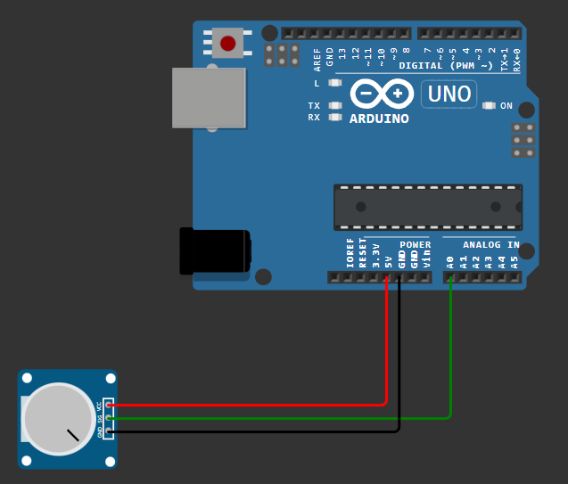

# Lectura de Potenciómetro con Arduino

Programa para Arduino que lee el valor de un potenciómetro conectado a uno de sus pines analógicos y muestra este valor a través del monitor serial.

## Requisitos

- Placa de desarrollo Arduino (Arduino UNO)
- Potenciómetro
- Cableado para conectar el potenciómetro a la placa Arduino

## Conexiones

El potenciómetro debe conectarse a uno de los pines analógicos de la placa Arduino:

## Instalación

1. Conecta el potenciómetro a la placa Arduino según las especificaciones de conexión.
2. Carga el archivo `potentiometer.ino` en tu placa Arduino utilizando el IDE de Arduino.
3. Abre el monitor serial para ver los valores leídos del potenciómetro.

## Funcionamiento

El programa lee continuamente el valor del potenciómetro y lo muestra en el monitor serial. Este valor representa la posición del potenciómetro en una escala de 0 a 1023, donde 0 corresponde a la posición mínima y 1023 a la posición máxima.

## Configuración

Asegúrate de definir correctamente el pin analógico al que está conectado el potenciómetro en la variable `analogPin` en el código. Esta variable debe coincidir con el pin al que está conectado físicamente el potenciómetro en tu configuración.
