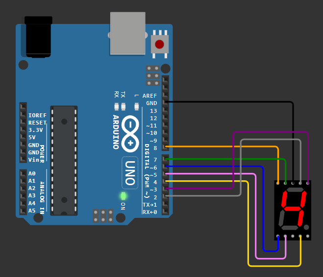

# Display de Siete Segmentos con Arduino

Programa para Arduino que muestra números del 0 al 9 en un display de siete segmentos utilizando pines digitales.

## Requisitos

- Placa de desarrollo Arduino (Arduino UNO)
- Display de siete segmentos (Cátodo común)
- Resistencias (si es necesario, dependiendo del tipo de display)
- Cableado para conectar el display de siete segmentos a la placa Arduino

## Conexiones

El display de siete segmentos debe conectarse a los pines digitales de la placa Arduino según el esquema de conexiones proporcionado en el código. Asegúrate de revisar la hoja de datos del display para conocer las especificaciones de conexión exactas; en este caso, se utilizo un Display de 7 segmentos _cátodo común_:

## Instalación

1. Conecta el display de siete segmentos a la placa Arduino según las especificaciones de conexión.
2. Carga el archivo `seven_segment.ino` en tu placa Arduino utilizando el IDE de Arduino.
3. Observa cómo se muestran los números del 0 al 9 en el display de siete segmentos.

## Funcionamiento

El programa utiliza un array de bytes predefinido que contiene los patrones de segmentos necesarios para mostrar cada dígito del 0 al 9 en el display de siete segmentos. Luego, utiliza ciclos para activar los segmentos correspondientes para mostrar cada número.

## Configuración

Asegúrate de definir correctamente los pines a los que está conectado cada segmento del display de siete segmentos en el array `segmentPins`. Además, define el pin al que está conectado el cátodo común del display en la variable `commonCathodePin`.

> [!IMPORTANT]
> En el código se configura el pin 9 como el cátodo común, pero este tambien se puede conectar a tierra.
